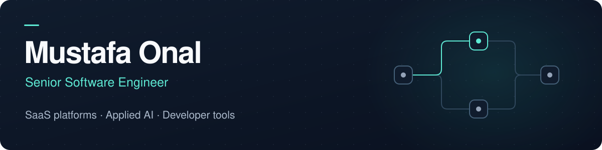
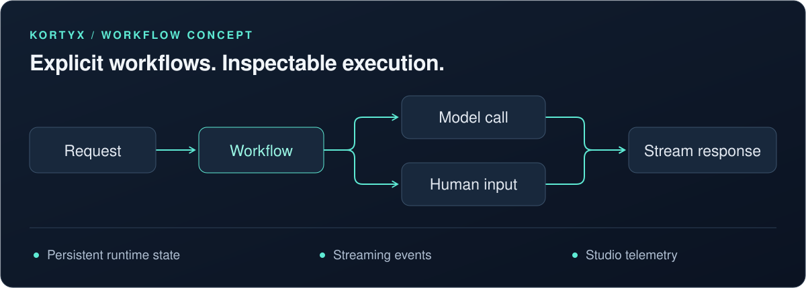

  

  <a href="https://mustafa-onal.com/">Portfolio</a> ·
  <a href="https://www.linkedin.com/in/mustafasaitonal/">LinkedIn</a> ·
  <a href="https://kortyx.io/">Kortyx</a>

I build software across the stack, from APIs and interfaces to AI workflows and production infrastructure. Based in Barcelona, with a focus on TypeScript, clear architecture, and systems that teams can understand and operate.

  
  
  
  
  

## Building Kortyx

**[Kortyx](https://github.com/kortyx-io/kortyx)** is a TypeScript framework for AI agents with explicit workflows, streaming, persistent state, and human-in-the-loop interrupts.

I'm building the runtime, provider integrations, React bindings, CLI, and self-hosted observability Studio. The goal: make agent behavior explicit, inspectable, and easier to integrate into real applications.

[Explore the code](https://github.com/kortyx-io/kortyx) · [Read the docs](https://kortyx.io/docs/start-here)

Active beta. Framework, CLI, and telemetry API: Apache-2.0. Studio UI: source-available under Elastic License 2.0.

## Beyond open source

**Workfully · Recruitment marketplace software & agentic automation**

Building backend capabilities and agentic automation for recruitment operations, alongside the operational control center. My work connects platform business logic, reliable marketplace metrics, and agent workflows to help teams identify and act on stalled hiring pipelines.

**CleverConnect · AI interviewing & assessment**

Led the technical foundations of a multi-tenant interviewing product, spanning real-time voice and chat, AI workflow orchestration, durable interview analysis, and deployment infrastructure.

## Also built

**[NextShopKit](https://github.com/NextShopKit/sdk)**

A published TypeScript SDK for custom Shopify storefronts with Next.js. Typed Storefront API abstractions, metafield parsing, and cart state management.

Past project, no longer actively maintained.

---

I care about typed contracts, explicit business rules, observable workflows, and developer tools that make complex systems easier to work on.
